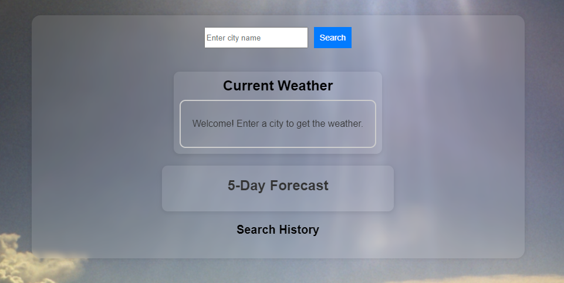
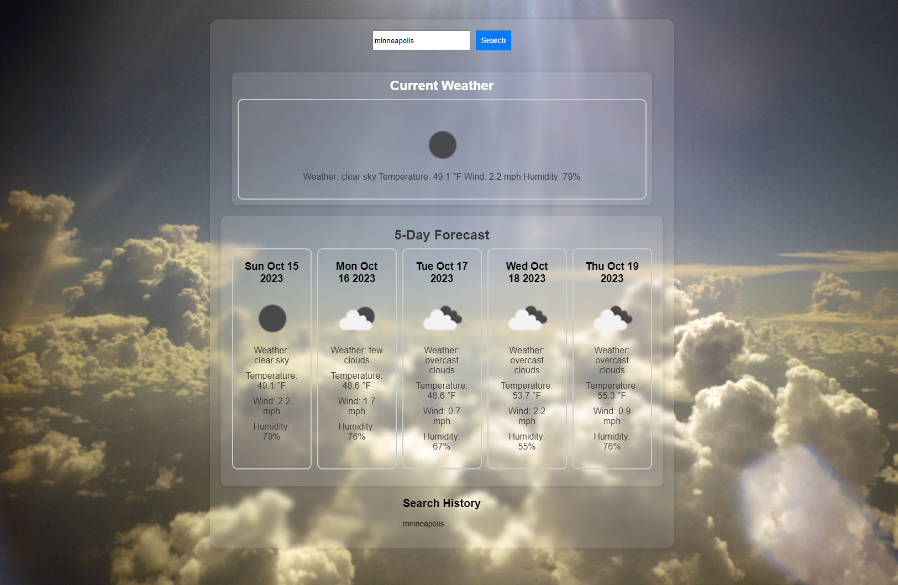

# Weather App

This app will allow the user to enter any city in the world and get the next five day forecast for that location.

The forecast will display the weather condition for that location such as the temperture, wind, and humidity.

# Scrren shot of Application

# Deploy Link

https://freeway9527.github.io/XengXiong_Challenge6_WeatherApp/

# Reference 

KellySoftware, LLC. (2020b). Weather1. Retrieved October 13, 2023, from https://www.weather1.com/wallpapers.php. 

Jana, S. (2022, June 2). How to make a weather app using JavaScript. DEV Community. https://dev.to/shantanu_jana/how-to-make-a-weather-app-using-javascript-4lke 

CodingNepal. (2023, June 28). How to build a weather app in HTML CSS and JavaScript. CodingNepal. https://www.codingnepalweb.com/weather-app-project-html-javascript/ 